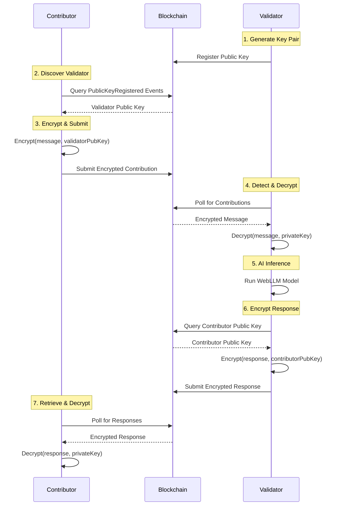

# Secure Remote Architecture

## Overview

The **Secure Remote Architecture** is a critical component of the AIA Chain that enables contributors and validators to operate on **separate machines** while maintaining complete data privacy through **end-to-end encryption**.

## Problem Statement

Traditional machine learning systems often require data to be sent to centralized servers where it can be inspected by operators. For AI inference networks, this creates several challenges:

1. **Privacy**: Contributors don't want validators to see their raw queries
2. **Trust**: No central authority should have access to unencrypted data
3. **Decentralization**: Separate machines need a secure communication channel

## Solution Architecture

### 1. Transport Layer: On-Chain Storage

Instead of using centralized servers, AIA Chain stores **encrypted messages** directly on the Polygon blockchain:

**Benefits:**
- ✅ Decentralized and censorship-resistant
- ✅ Persistent and auditable
- ✅ Works instantly across machines
- ✅ No external infrastructure needed

**Trade-offs:**
- ⚠️ Gas costs (acceptable on Polygon Amoy testnet)
- ⚠️ Size limits (suitable for chat messages)

### 2. Privacy Layer: Asymmetric Encryption

AIA Chain implements a **Public Key Infrastructure (PKI)** using browser-generated RSA-OAEP keys:



## Implementation Details

### Cryptographic Keys

**Generation:**
```typescript
const keyPair = await crypto.subtle.generateKey(
  {
    name: "RSA-OAEP",
    modulusLength: 2048,
    publicExponent: new Uint8Array([1, 0, 1]),
    hash: "SHA-256",
  },
  true,
  ["encrypt", "decrypt"]
);
```

**Storage:**
- Keys are stored in **IndexedDB** for persistence
- Private keys are **non-exportable** (browser security feature)
- Public keys are exported as Base64 and registered on-chain

**Encryption:**
```typescript
const encrypted = await crypto.subtle.encrypt(
  { name: "RSA-OAEP" },
  publicKey,
  new TextEncoder().encode(message)
);
```

### Smart Contract Integration

The `AIA_Chain.sol` contract includes:

```solidity
// Public Key Registry
mapping(address => string) public validatorPublicKeys;

// Register public key
function registerPublicKey(string memory _publicKey) external {
    validatorPublicKeys[msg.sender] = _publicKey;
    emit PublicKeyRegistered(msg.sender, _publicKey);
}

// Submit encrypted contribution
function submitContribution(
    bytes32 _gradientHash,
    bytes32 _proofHash,
    string memory _encryptedData,  // <-- Encrypted message
    uint256 _epsilon,
    uint8 _requestedValidators,
    bool _isPriority
) external payable returns (bytes32)

// Submit encrypted response
function submitValidationWork(
    bytes32 _contributionId,
    uint256 _computeTimeSeconds,
    bytes32 _validationProof,
    string memory _encryptedResponse,  // <-- Encrypted AI response
    uint256 _qualityScore
) external
```

### Validator Discovery

Contributors discover active validators by querying `PublicKeyRegistered` events:

```typescript
const events = await contract.queryFilter(
    contract.filters.PublicKeyRegistered(),
    fromBlock,
    toBlock
);
```

**Pagination:**
To avoid RPC limits, events are queried in 200-block chunks:
```typescript
const MAX_BLOCK_RANGE = 200;
for (let end = currentBlock; end > start; end -= MAX_BLOCK_RANGE) {
    const events = await contract.queryFilter(
        filter,
        Math.max(0, end - MAX_BLOCK_RANGE),
        end
    );
}
```

## Privacy Guarantees

### Ephemeral Decryption

Validators implement "eyes-off" data handling:

1. **Decrypt in Memory Only**: Decrypted text is never stored in React state, localStorage, or DOM
2. **Immediate Cleanup**: Decrypted variables are overwritten after use
3. **No Logging**: Raw contributor data is never logged to console

```typescript
// Decrypt (in-memory only)
let decryptedMessage = await CryptoService.decrypt(
    encryptedData, 
    privateKey
);

// Run AI inference
const aiResponse = await generateResponse(messages);

// Clear from memory
decryptedMessage = "";  // Immediate cleanup

// Encrypt response for contributor
const encryptedResponse = await CryptoService.encrypt(
    aiResponse, 
    contributorPublicKey
);
```

### Threat Model

**What we protect against:**
- ✅ Validators reading contributor queries
- ✅ Contributors reading other users' data
- ✅ Blockchain observers seeing raw messages
- ✅ Man-in-the-middle attacks (public key on-chain)

**What we DON'T protect against (browser limitations):**
- ❌ Malicious validator modifying their own code to log decrypted data
- ❌ Browser extensions with `debugger` access
- ❌ Physical access to validator machine

**Future: Trusted Execution Environments (TEE)**

For production deployments requiring absolute security, validators should run in:
- **Intel SGX** enclaves
- **AWS Nitro** enclaves
- **Azure Confidential Computing**

These provide hardware-level guarantees that code hasn't been tampered with.

## Performance Considerations

### Gas Costs

**On Polygon Amoy (Testnet):**
- Registering public key: ~50,000 gas (~$0.001)
- Submitting encrypted contribution: ~100,000 gas (~$0.002)
- Submitting encrypted response: ~80,000 gas (~$0.0016)

**On Polygon Mainnet:**
- Similar gas amounts but with MATIC costs

### Message Size Limits

**RSA-OAEP with 2048-bit keys:**
- Maximum plaintext size: ~190 bytes per block
- For longer messages: Use hybrid encryption (RSA for AES key, AES for data)

**Current Implementation:**
- Direct RSA encryption for messages up to ~500 characters
- Future: Hybrid encryption for longer conversations

## Security Best Practices

### For Contributors

1. **Verify Validator Public Key**: Check on-chain registration
2. **Use Unique Keys**: Don't reuse keys across applications
3. **Backup Keys**: Export and securely store your private key
4. **Clear Browser Data Carefully**: Clearing IndexedDB will delete your keys

### For Validators

1. **Secure Your Environment**: Run validators on trusted hardware
2. **Keep Browser Updated**: Security patches are critical
3. **Monitor Key Access**: Log all key usage for audit trails
4. **Implement Rate Limiting**: Prevent spam attacks

## Troubleshooting

### "Validator keys not ready"
**Cause**: Keys are initialized asynchronously
**Solution**: Wait for "Secure Enclave Active" status before processing

### "Decryption failed"
**Cause**: Message was encrypted for a different validator
**Solution**: This is expected; validators should skip contributions not for them

### "Block range too large"
**Cause**: RPC limits on event queries
**Solution**: Implemented chunked fetching (200 blocks per query)

## Related Documentation

- [Cryptography Details](../security/cryptography.md)
- [Smart Contract Design](../contracts/design.md)
- [Validator Guide](../guides/validator-guide.md)
