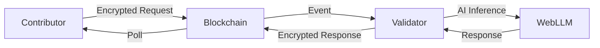

# AIA Chain Documentation

Welcome to the technical documentation for **AIA Chain** - the world's first truly decentralized AI inference network built on the SENEX Intelligent Chain.

## What is AIA Chain?

AIA Chain is a permissionless, blockchain-based AI inference network that enables:
- **Secure, encrypted AI inference** for contributors
- **Transparent, permissionless validation** with economic incentives
- **Privacy-preserving communication** using end-to-end encryption
- **Browser-native AI models** powered by WebLLM

## Quick Start

Choose your path:

- **[For Contributors](./guides/contributor-guide.md)** - Submit AI inference requests and earn reputation
- **[For Validators](./guides/validator-guide.md)** - Run a validator node and earn rewards
- **[Smart Contracts](./contracts/overview.md)** - Understand the on-chain architecture
- **[Security](./security/encryption.md)** - Learn about our privacy architecture

## Key Features

### 🔐 End-to-End Encryption
All contributor messages are encrypted using RSA-OAEP before being submitted to the blockchain. Only the targeted validator can decrypt and process the request.

### ⚡ Permissionless Validation
Anyone can become a validator. No registration, no staking required. Payment is based on:
- **Speed** - Faster compute time = higher reward
- **Quality** - Higher accuracy score = higher reward
- **Consensus** - Agreement with peer validators = bonus

### 🌐 Browser-Native AI
Validators run AI models directly in the browser using WebLLM, ensuring:
- No server dependencies
- Complete decentralization
- Transparent execution

### 💰 Fair Economic Model
Contributors pay a small fee per request, which is distributed to validators based on performance metrics.

## Architecture Overview

## Getting Started

1. **[Installation](./guides/installation.md)** - Set up the AIA Chain application
2. **[Configuration](./guides/configuration.md)** - Configure your environment
3. **[First Request](./guides/first-request.md)** - Submit your first AI inference request

## Technical Deep Dives

- **[Secure Remote Architecture](./architecture/secure-remote.md)** - How we achieve data privacy
- **[Cryptography](./security/cryptography.md)** - Browser-native encryption implementation
- **[Smart Contract Design](./contracts/design.md)** - On-chain logic and economics
- **[Validator Rewards](./economics/validator-rewards.md)** - Reward calculation mechanics

## Community

- **GitHub**: [senexic/aia](https://github.com/senexic/aia)
- **Website**: [senexic.io](https://senexic.io)
- **Docs**: [docs.senexic.io](https://docs.senexic.io)