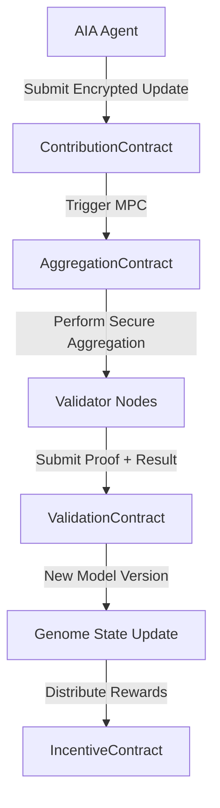

# INTELLIGENT CHAIN (Blockchain Infrastructure)

Custom blockchain network optimized for AI computation, data coordination, and token economics.

## Architecture

### Consensus Mechanism
- **Phase 1 (Current)**: Polygon PoS with [ASHA token](../tokenomics/index.md) integration
- **Phase 2 (Custom L1)**: Proof-of-Contribution (PoC) + Proof-of-Stake (PoS)
  - Validators stake [ASHA tokens](../tokenomics/index.md)
  - Additional weight for data/compute contributions
  - Slashing for malicious behavior or model poisoning

### Smart Contract Layers

#### Layer 1 - Core Contracts
- **TokenContract**: ERC-20 compliant [ASHA token](../tokenomics/index.md) with extensions
- **GovernanceContract**: DAO voting, proposal submission, execution
- **StakingContract**: Validator staking, delegation, rewards

#### Layer 2 - AI Coordination Contracts
- **ContributionContract**: Receives encrypted gradients from [AIA agents](aia_agents.md)
- **AggregationContract**: Coordinates secure MPC for gradient aggregation
- **ValidationContract**: Validates model updates and proof submissions
- **IncentiveContract**: Calculates and distributes rewards

#### Layer 3 - Application Contracts
- **QueryContract**: Handles computation requests from [AIA agents](aia_agents.md)
- **DataMarketplace**: Optional peer-to-peer data exchange
- **ReputationContract**: Tracks contributor quality and reliability

### Data Flow

### Storage Architecture
- **On-Chain**: Transaction records, state roots, contribution metadata
- **IPFS**: Model weights, large datasets, training checkpoints
- **Arweave**: Permanent archive of governance decisions and model versions
- **Local**: Client data never leaves device unless explicitly encrypted

### Scalability Solutions
- **Layer 2 Rollups**: Optimistic or zk-Rollups for high-throughput transactions
- **Sharding**: Partition network by application domain (health, finance, etc.)
- **Off-Chain Computation**: Heavy AI inference on validators with proofs
- **State Channels**: Direct peer-to-peer for real-time applications
