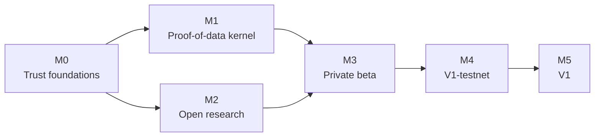

# Roadmap

:::info Outcome-based roadmap
This roadmap describes milestones and the evidence that ends each one, not calendar promises. The current milestone is **M0**. There is no public network, and ASHA in the software is simulated accounting only.
:::

SENEX moves through six milestones. A milestone ends only when its exit gates pass. Each exit claims only what it proves: finishing a milestone is never a claim that V1 exists.

## M0 — Trust foundations

**Status: current milestone**

Goal: make every public statement, stored key, and plan honest and coherent before building further.

Exit gates:

- no public surface makes a claim the software contradicts;
- a fresh install stores no plaintext wallet key, vault key, or privacy secret; and
- the full test suite passes on the main branch in continuous integration.

Exiting M0 claims only trust hygiene. It makes no network, economy, or product-readiness claim.

## M1 — Proof-of-data kernel

**Status: Research direction**

Goal: show, with real owners on separate internet-connected machines, that value can be measured at the moment data is used, across owners, in a way that is hard to game. See [Proof of data](thesis.md).

Planned work includes real peer-to-peer transport, recursive governed access, computation sent to the data, impact scoring when data is first used, settlement that applies exactly once after finality, and detection of poisoned data. Contribution is recorded as points that carry no monetary value.

Exit gates:

- real owners on several distinct networks run the kernel for a sustained period;
- most participants rate the credit they received as fair;
- a red-team attempt to poison data is detected and loses its credit; and
- in compute-to-data mode, raw data never leaves its owner's machine, verified by protocol tests and traffic inspection.

## M2 — Open research

**Status: Research direction**

Goal: research the framework SENEX uses to rank knowledge in the open, choose its design on published evidence, and disclose it wherever ranked content appears.

Exit gates:

- the research report is published, including negative results;
- the design is chosen on that evidence; and
- every product surface that shows ranked content discloses how it is ranked.

M2 runs alongside M1.

## M3 — Private beta

**Status: Research direction**

Goal: put the kernel into a product ordinary people can use and keep using. Planned work includes signed desktop apps for macOS, Windows, and Linux, a chat-first experience with conversation history, durable local storage, a mobile companion, and an independent security audit of the kernel.

Exit gates:

- a meaningful share of beta users remain active after four weeks;
- most answers draw on data from other owners, with their contribution credited; and
- all audit findings on the kernel are closed.

The private beta is not V1-testnet.

## M4 — V1-testnet

**Status: V1-testnet target**

Goal: run the complete V1 product and protocol with test-only ASHA and independent validators. Settlement is built on an established consensus framework, not on hand-rolled consensus, and validators operate across several jurisdictions.

Exit gates:

- every V1-testnet qualification gate, G0 to G13, exits, including a sustained stability period; and
- independent protocol and economic reviews are complete.

V1-testnet state never migrates to V1. See [Network transition](migration.md).

## M5 — V1

**Status: External validation required**

Goal: launch V1 as a separate production network from a fresh genesis, once regulators, independent reviewers, and independent validators allow it.

Exit gates:

- regulatory clearance is recorded for each launch jurisdiction;
- the fresh genesis is activated; and
- independent validators hold the majority.

Any live use of ASHA depends on these gates and is described in the SENEX white paper, not in these docs. See [ASHA and contribution](tokenomics/index.md).

## Longer-term research

**Status: Research direction**

- [GENOME](architecture/genome.md): collective intelligence across independently governed participants.
- Open, permissionless admission that resists Sybil identities.
- Formal privacy for multi-party cooperation.
- Knowledge generation as the main measure of value.

These are directions, not delivery promises.

## How progress is reported

Progress updates name the milestone and the gate, state what was actually evaluated, publish limitations, and separate internal results from independent findings. [Current status](status.md) is updated when the software changes. Dates, scale, and performance claims appear only when backed by reproducible evidence.

Related pages:

- [Current status](status.md)
- [Applications and use cases](applications.md)
- [Scalability and performance](scalability.md)
- [Governance model](governance.md)
- [Network transition and upgrade policy](migration.md)
